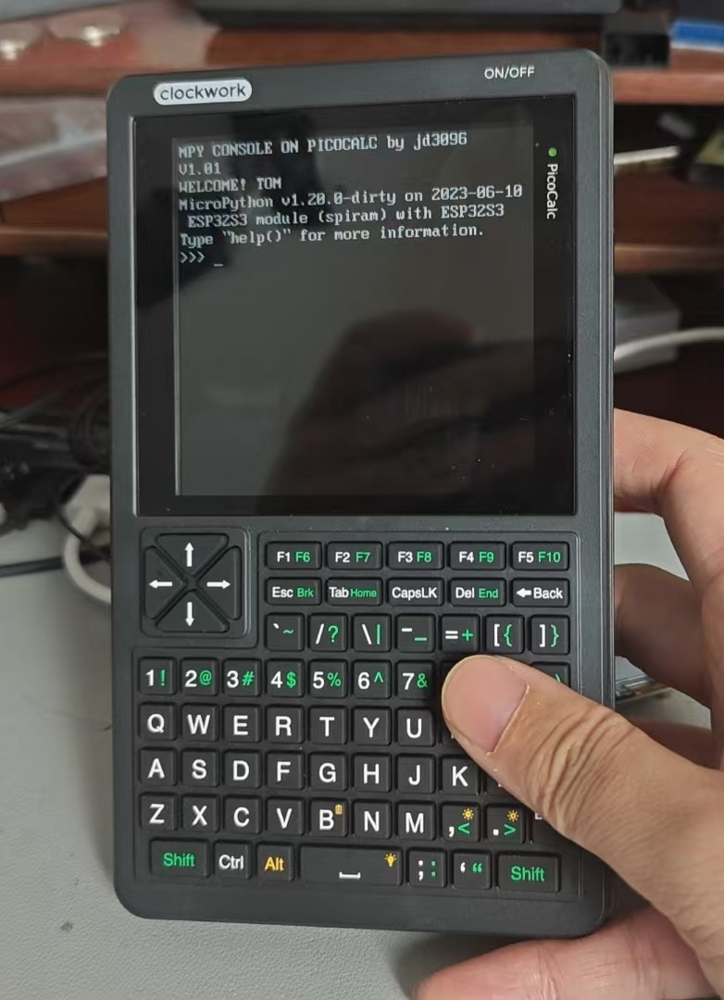

# PICOCALC-micropython

**Hardware:** WalnutPi-Pico
**Usage:**

1. Flash the firmware from the `firmware` folder to the ESP32-S3.
2. Use Thonny to package and upload all files from the `src` folder to the development board.

**Note:** This is only a test version. Feel free to share your ideas and suggestions in the **Issues** section!

